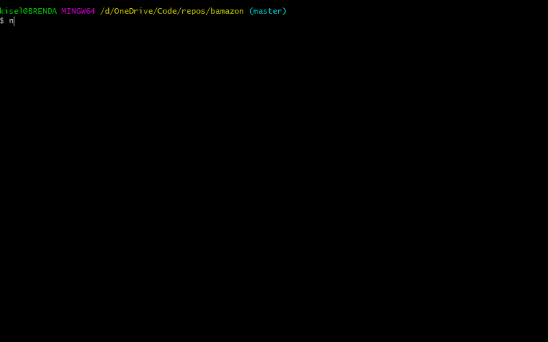

# bamazon
A mySQL/node.js app for manipulating a basic database. It consists of a SQL schema and seed files for initializing and adding to the database, and several node.js files for actually working with it from the command line.

1. [Requirements and Installation](#requirements-and-installation)
1. [How to Use](#how-to-use)
    1. [Customer Interface](#customer-interface)
    1. [Manager Interface](#manager-interface)
    1. [Supervisor Interface](#supervisor-interface)
1. [How It Works](#how-it-works)
1. [About](#about)

## Requirements and Installation

Bamazon is a [node.js](https://nodejs.org/en/) and [mySQL](https://www.mysql.com/) application. Go to their sites and read their documentation for help installing and configuring these applications.

Bamazon is currently configured to look for localhost:3306 and log in as root with no password.

You may need to run the following query on your database to get bamazon running:

```sql
ALTER USER 'root'@'localhost' IDENTIFIED WITH mysql_native_password BY ''
```

Once you have mySQL running, use the included `bamazon-schema` and `bamazon-seed` files to create and populate the bamazon database.

In addition to node.js, there are several node packages required by bamazon: `mysql`, `inquirer`, `cli-table2`. The included `package.json` file allows you to install them all at once by simply running `npm install` from the command-line in the bamazon directory.

## How to Use

### Customer Interface

The Customer Interface allows the user to purchase a product from the bamazon storefront, in the form of a command-line table.

Invoke the customer interface with:

```bash
node bamazonCustomer.js
```

The opening menu describes each of the functions of the Customer Interface. Both `View Catalog` and `Make Purchase` will display the product catalog, but the former will ask if one wants to make a purchase and the latter will simply begin the purchase process.


### Manager Interface

The Manager Interface allows the user to view products and their sales, check low inventory, add inventory, and add new items.

Invoke the manager interface with:

```bash
node bamazonManager.js
```

You will then be presented with a main menu of various functions to choose from. `Add to Inventory` is identical to `View Products for Sale` except it directly prompts the user to add inventory, rather than directing them back to the main menu first.


### Supervisor Interface

The Supervisor Interface allows the user to view sales departments, see departmental costs, sales, and profits, and add new departments.

Invoke the supervisor interface with:

```bash
node bamazonSupervisor.js
```

You will then be presented with the now familiar main menu of funtions implemented by this interface.



## How It Works

Bamazon consists of three node.js files each configured to request data from a running SQL server, currently configured to look for localhost:3306. Each application guides the user&#8211;playing the role of either a cusomer, manager, or supervisor&#8211;through a series of fictional transactions and data requests.

Each file interacts with a mySQL database using the `mysql` npm package, which is responsible for making the connection to the database, and sending and recieving data from it in the form of queries.

Queries take several forms. Most commonly, a query is used to display records from the database to the command line. The actual tables are made with the `cli-table2` npm package, which is responsible for defining the `Table` objects the data got inserted into. Additionally, queries add and update the information in each database table when the "customer" makes a "purchase" or when the "manager" updates the "inventory" or adds a new "product."

Another, less obvious query, happens in the Manager Interface when adding a new product. A query is made to create an array which is used by the `inquirer` npm package to populate a choice list to ensure the user cannot add a new product to a department that doesn't exist.

## About

Bamazon is the result of an assignment for the U of M Full Stack Web Development Boot Camp. It was written entirely by me [Tom Christ](https://kiselblat.github.io/).
