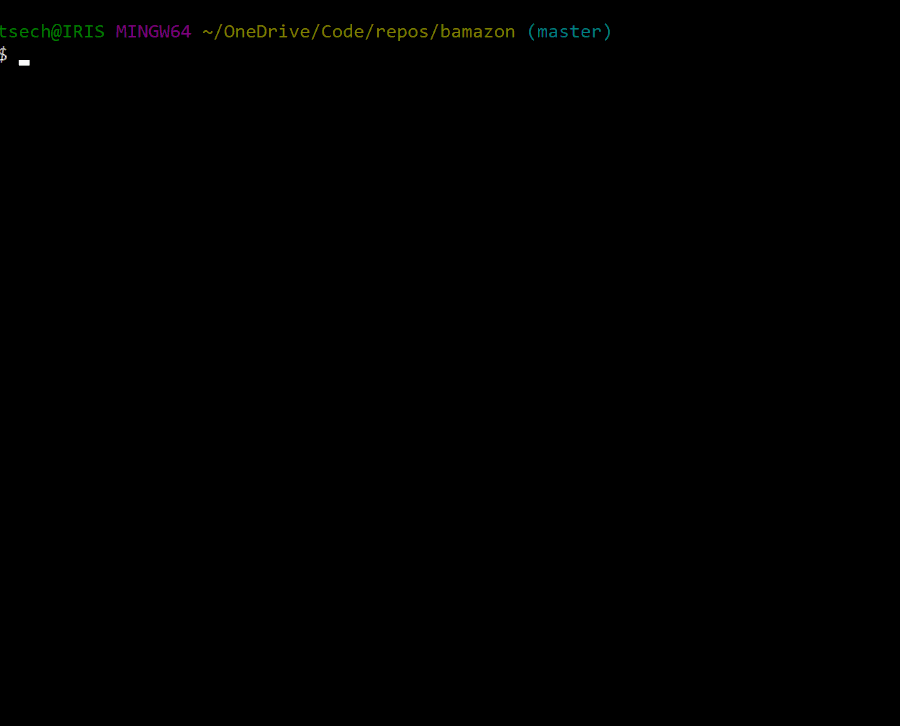
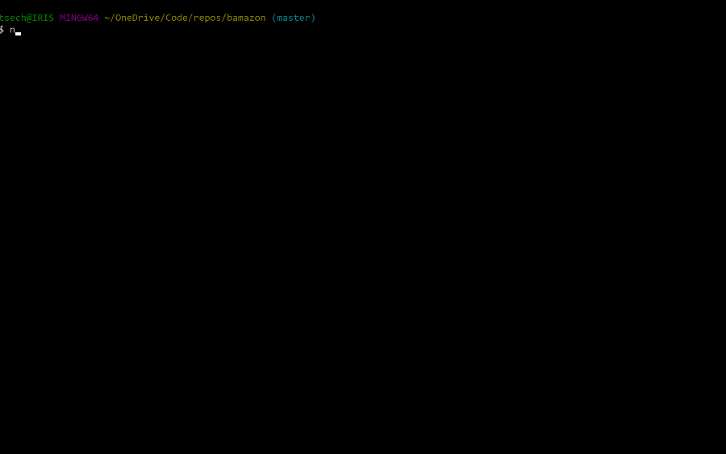

# bamazon
A mySQL/node.js app for manipulating a basic database. It consists of a SQL schema and seed files for initializing and adding to the database, and several node.js files for actually working with it from the command line.

1. [Requirements and Installation](#requirements-and-installation)
1. [How to Use](#how-to-use)
    1. [Customer Interface](#customer-interface)
    1. [Manager Interface](#manager-interface)
    1. [Supervisor Interface](#supervisor-interface)
1. [Overview](#overview)
1. [About](#about)

## Requirements and Installation

Bamazon is a [node.js](https://nodejs.org/en/) and [mySQL](https://www.mysql.com/) application. Go to their sites and read their documentation for help installing and configuring these applications.

Once you have mySQL running, use the included `bamazon-schema` and `bamazon-seed` files to create and populate the bamazon database.

In addition to node.js, there are several node packages required by bamazon: `mysql`, `inquirer`, `cli-table2`. The included `package.json` file allows you to install them all at once by simply running `npm install` from the command-line in the bamazon directory.

## How to Use

### Customer Interface

The Customer Interface allows the user to purchase a product from the bamazon storefront, in the form of a command-line table.

Invoke the customer interface with:

```
node bamazonCustomer.js
```

The opening menu describes each of the functions of the Customer Interface. Both `View Catalog` and `Make Purchase` will display the product catalog, but the former will ask if one wants to make a purchase and the latter will simply begin the purchase process.



### Manager Interface

The Manager Interface allows the user to view products and their sales, check low inventory, add inventory, and add new items.

Invoke the manager interface with:

```
node bamazonManager.js
```

You will then be presented with a main menu of various functions to choose from. `Add to Inventory` is identical to `View Products for Sale` except it directly prompts the user to add inventory, rather than directing them back to the main menu first.



### Supervisor Interface

The Supervisor Interface 

## Overview


## About

Bamazon is the result of an assignment for the U of M Full Stack Web Development Boot Camp. It was written entirely by me [Tom Christ](https://kiselblat.github.io/).